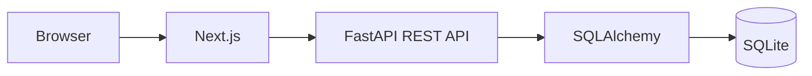
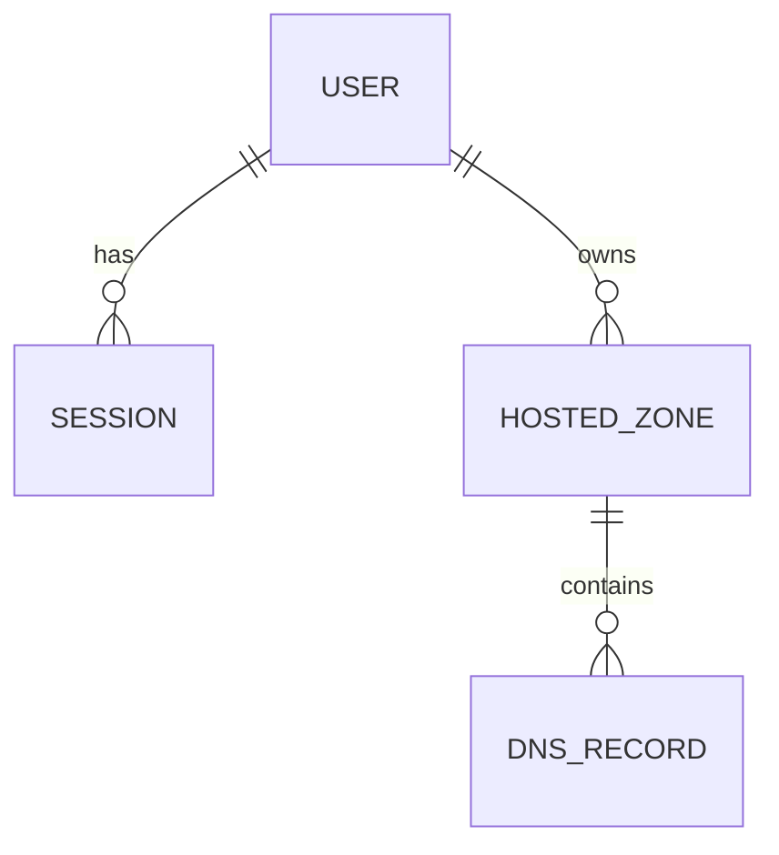

# Route 53 Clone

An educational full-stack clone of key AWS Route 53 console workflows. It recreates hosted-zone and DNS-record management for learning and assessment purposes; it does **not** provide real DNS hosting and is not affiliated with AWS.

## Features

- AWS-console-inspired shell built with Cloudscape `TopNavigation`, `AppLayout`, `SideNavigation`, and breadcrumbs
- Persistent Light, Dark, and System appearance modes powered by Cloudscape native visual modes
- Persistent HTTP-only cookie authentication with session expiry and logout invalidation
- Hosted-zone CRUD, search, filtering, sorting, pagination, and multi-selection
- DNS-record CRUD, type-aware validation, filtering, sorting, and pagination
- Transactional public-zone creation with protected mock NS and SOA records
- Confirmation modals, loading/error/empty states, and Flashbar feedback
- Transactional BIND import, JSON/BIND export, and system-aware bulk deletion
- Mock Dashboard, Health checks, Traffic policies, Resolver, and Profiles sections

## Screenshots

Add final screenshots before submission:

- `docs/screenshots/hosted-zones.png`
- `docs/screenshots/create-hosted-zone.png`
- `docs/screenshots/hosted-zone-details.png`
- `docs/screenshots/create-record.png`

## Tech stack

| Layer       | Technology                                         |
| ----------- | -------------------------------------------------- |
| Frontend    | Next.js 16 App Router, React 19, strict TypeScript |
| UI          | AWS Cloudscape Design System                       |
| Backend     | FastAPI, Pydantic Settings, Uvicorn                |
| Persistence | SQLAlchemy 2 and SQLite                            |
| Quality     | pytest, Ruff, ESLint, Prettier, Node test runner   |

## Architecture



The frontend owns presentation and browser session state. Browser data access goes through typed API modules. FastAPI routers validate transport data and delegate rules to services. SQLAlchemy models enforce relationships and database constraints.

## Repository structure

```text
.
├── backend/
│   ├── app/
│   │   ├── api/                 # Dependencies and versioned routers
│   │   ├── core/                # Environment configuration
│   │   ├── db/                  # Engine, sessions, initialization
│   │   ├── services/            # Authentication and DNS rules
│   │   ├── models.py            # SQLAlchemy models
│   │   └── schemas.py           # API schemas
│   └── tests/
├── frontend/
│   ├── app/                     # App Router pages and boundaries
│   ├── components/              # Auth, shell, and Route 53 UI
│   ├── lib/api/                 # Typed HTTP clients
│   └── types/
└── docs/
```

## Local setup

Prerequisites: Python 3.12, Node 22.19–22.x, and npm 10+. From a fresh clone, open two terminals at the repository root. Environment files are optional because development defaults are included.

## Backend setup

```powershell
cd backend
python -m venv .venv
.\.venv\Scripts\python.exe -m pip install -r requirements-dev.txt
Copy-Item .env.example .env
.\.venv\Scripts\python.exe -m uvicorn app.main:app --reload --port 8000
```

Startup creates missing tables and idempotently seeds the demo user. `create_all()` initializes a new database; schema evolution for valuable existing data should use migrations and backups.

## Frontend setup

```powershell
cd frontend
npm ci
Copy-Item .env.example .env.local
npm run dev
```

Open <http://localhost:3000>. Use `localhost` consistently so the configured origin and cookie behavior match.

### Appearance

Open the account menu in the top navigation and choose **Appearance** to select Light, Dark, or System. System is the default and follows operating-system appearance changes. The non-sensitive UI preference is stored in browser `localStorage` under `route53-theme`; Cloudscape's native visual modes and design tokens provide the mode-aware colors.

## Environment variables

### Backend

| Variable                   | Development default           | Purpose                            |
| -------------------------- | ----------------------------- | ---------------------------------- |
| `APP_ENV`                  | `development`                 | Environment label                  |
| `DATABASE_URL`             | `sqlite:///./data/route53.db` | SQLite file                        |
| `FRONTEND_ORIGIN`          | `http://localhost:3000`       | Exact credentialed CORS origin     |
| `SESSION_COOKIE_SECURE`    | `false`                       | Set `true` behind production HTTPS |
| `SESSION_COOKIE_NAME`      | `route53_session`             | Cookie name                        |
| `SESSION_LIFETIME_SECONDS` | `86400`                       | Session lifetime                   |

### Frontend

| Variable              | Development default            | Purpose          |
| --------------------- | ------------------------------ | ---------------- |
| `NEXT_PUBLIC_API_URL` | `http://localhost:8000/api/v1` | FastAPI base URL |

No production secrets are committed. Passwords and raw session tokens are never stored in plaintext.

## Database schema



| Entity     | Important fields                                                                      |
| ---------- | ------------------------------------------------------------------------------------- |
| User       | `id`, unique `username`, `password_hash`, `created_at`                                |
| Session    | `id`, unique token digest, `user_id`, `expires_at`, `created_at`                      |
| HostedZone | internal `id`, AWS-like `zone_id`, normalized `name`, type, owner, timestamps         |
| DNSRecord  | internal `id`, unique `record_id`, parent zone, name, type, value, TTL, policy, alias |

Foreign keys are indexed and SQLite foreign-key enforcement is enabled on every connection. Deleting a zone database-cascades to its records.

## API overview

Resource endpoints require a valid session cookie.

| Method           | Endpoint                                             | Purpose                         |
| ---------------- | ---------------------------------------------------- | ------------------------------- |
| POST             | `/api/v1/auth/login`                                 | Authenticate and set cookie     |
| POST             | `/api/v1/auth/logout`                                | Revoke session and clear cookie |
| GET              | `/api/v1/auth/me`                                    | Return current user             |
| GET, POST        | `/api/v1/hosted-zones`                               | List or create zones            |
| GET, PUT, DELETE | `/api/v1/hosted-zones/{zone_id}`                     | Zone CRUD                       |
| GET, POST        | `/api/v1/hosted-zones/{zone_id}/records`             | List or create records          |
| GET, PUT, DELETE | `/api/v1/hosted-zones/{zone_id}/records/{record_id}` | Record CRUD                     |
| POST             | `/api/v1/hosted-zones/{zone_id}/records/bulk-delete` | Bulk delete records             |
| POST             | `/api/v1/hosted-zones/{zone_id}/records/import`      | Transactional BIND import       |
| GET              | `/api/v1/hosted-zones/{zone_id}/records/export`      | BIND or JSON export             |

## Authentication design

Passwords use scrypt with a random salt. Login creates a cryptographically random token, stores only its SHA-256 digest, and sends the raw token in an HTTP-only, SameSite=Lax cookie. Every protected request verifies database presence and expiry. Logout deletes the session before clearing the cookie. The frontend never stores authentication in `localStorage`.

## Hosted Zone workflow

Users see only their own zones. Names are IDNA-normalized, lowercased, stripped of a trailing dot, validated, and unique per owner. Public zones create mock NS and SOA records in the same transaction. The UI supports search, type filtering, server sorting and pagination, refresh, creation, editing, and typed-confirmation deletion.

## DNS Record workflow

Records are scoped through the owner and parent zone. Names accept `@`, the root, or a relative subdomain. Supported types are A, AAAA, CNAME, TXT, MX, NS, PTR, SRV, CAA, and SOA. TTL is positive and routing currently supports `SIMPLE`. Only generated system NS/SOA records are protected; user-created records, including NS records, can be deleted.

## Search, filter, and pagination implementation

The UI sends search, type, page, page-size, sort-field, and direction parameters to FastAPI. SQL filtering and counting happen before offset pagination. UI state resets to page one when filters change and distinguishes empty resources from no-result searches.

## Testing

```powershell
cd backend
.\.venv\Scripts\python.exe -m ruff check .
.\.venv\Scripts\python.exe -m pytest

cd ..\frontend
npm run lint
npm run typecheck
npm test
npm run build
```

Backend tests use isolated in-memory databases and cover initialization, hashing, sessions, ownership, cascades, CRUD, validation, collections, default-record deletion, BIND import/export, bulk deletion, and rollback.

## Bonus features

- Upload or paste BIND content, preview line validity, and import atomically
- JSON and BIND exports with all user-visible records
- Bulk record deletion that reports protected or missing records
- Multi-zone deletion with explicit confirmation and partial-failure feedback

## Deployment

The repository includes production-style Dockerfiles and a local Compose stack. The intended hosted topology is Next.js on Vercel and FastAPI on Railway with SQLite on a persistent Railway volume. See [Deployment](docs/DEPLOYMENT.md) for local commands, persistence behavior, and platform configuration.

## Demo credentials

- Account alias: `demo` (visual only)
- IAM user name: `admin`
- Password: `admin123`

## Limitations

- No real DNS, AWS IAM, VPC, DNSSEC, health-check, or traffic-policy integration
- BIND parsing intentionally supports a practical subset, not the complete RFC grammar
- Alias targets are hostname strings rather than AWS resource objects
- SQLite targets the assignment and small single-instance deployment, not high concurrency
- Fresh-database initialization is automatic; production schema upgrades need migrations

## Disclaimer

AWS, Route 53, and related marks belong to Amazon Web Services. This educational clone does not modify real DNS infrastructure.
