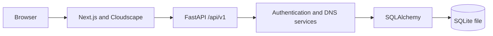

# Architecture

The browser renders a Next.js App Router application using Cloudscape. Typed clients under `frontend/lib/api` send credentialed requests to FastAPI. Versioned routers resolve a request-scoped SQLAlchemy session and current user, then delegate business rules to `backend/app/services`. ORM models and SQLite constraints provide durable integrity.

The frontend route shell is shared by all `/route53/*` pages. Authorization is enforced at the API data boundary; client route guards exist for user experience, not security. Hosted-zone creation and BIND import are transactional. Record ownership is inherited through the owned parent zone.

The deployment model is one FastAPI instance with a persistent SQLite disk and a separately deployed Next.js frontend. Both should use HTTPS subdomains under the same site for the current SameSite=Lax cookie policy.
